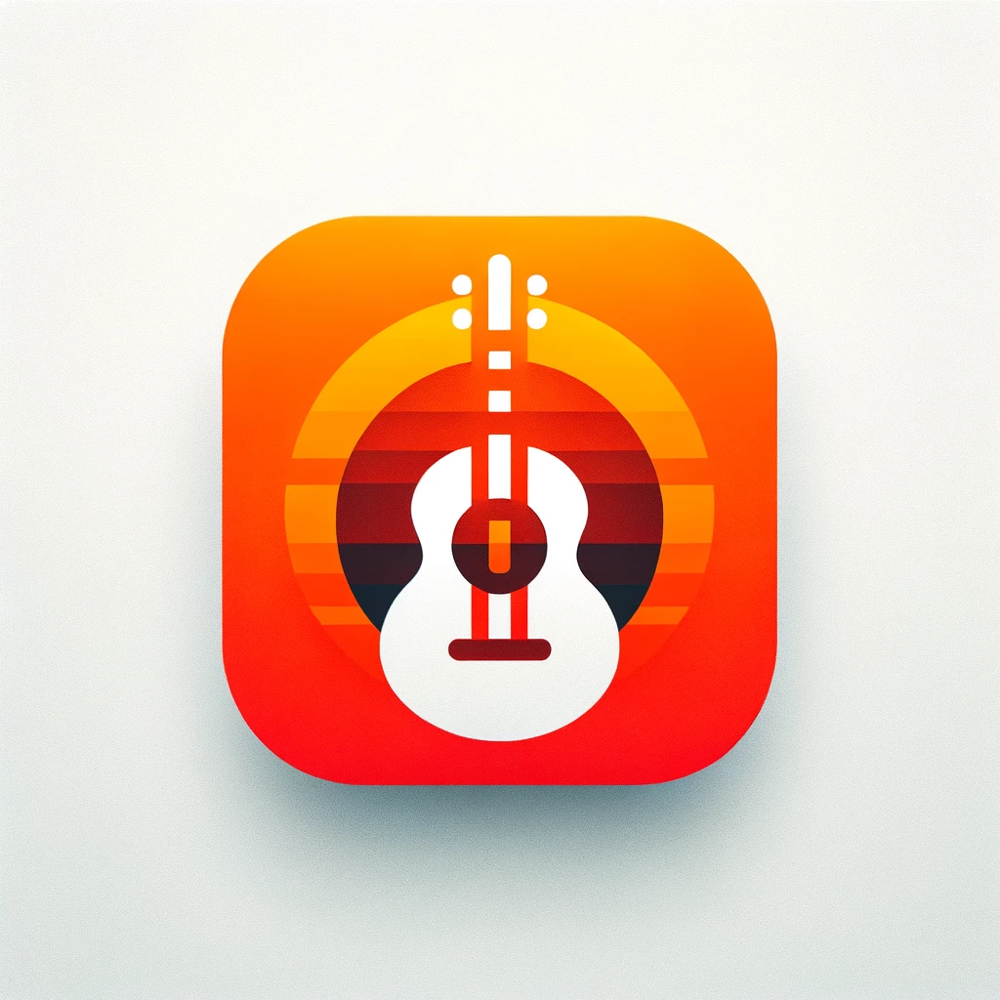

# Tidy Tune - Guitar Chord Transposer for macOS

  

Welcome to Tidy Tune, the musician's companion for the digital age! Our mission is simple: to provide an easy-to-use interface for accessing guitar chords, allowing you to focus on your music without the distractions of an internet browser.

## Features
- Search and view guitar chords for a vast library of songs.
- Instantly transpose chords to match your tuning or preference.
- Sleek macOS interface designed with the musician's workflow in mind.

## Getting Started

### Installation
To get started with Tidy Tune, download the latest version of the app for your Mac:

[Download Tidy Tune](https://drive.google.com/drive/folders/1uQ_HbvJTNOydNIysAF9sSQ7REFXSr_-8?usp=share_link)

**Note:** Tidy Tune is currently available only for macOS.

### How to Use Tidy Tune

1. **Open the Application**: When you launch Tidy Tune, you'll be greeted with a clean interface. (See `res/Opening.png`)
2. **Search for a Song**: Click on the search bar to type in the title of the song you're looking for. (Refer to `res/SearchResults.png`)
3. **View Guitar Chords**: Select the song from the search results to view the guitar chords. (Example in `res/GuitarChords.png`)
4. **Transpose Chords**: Use the transpose feature to adjust the chords to your tuning. (See `res/TransposedGuitarChords.png`)

## Support

Encountered a bug or have a feature request? Please open an issue on the GitHub repository.

## Contribute

Tidy Tune is in its alpha stage, and we welcome contributors! If you're interested in improving Tidy Tune, check out the source code and consider submitting a pull request.

## License

Distributed under the CC BY-NC 4.0 License. See `LICENSE` for more information.

## Acknowledgments

- All the musicians and testers who provided their valuable feedback.
- Icons and graphics provided in the `res` folder.

---

We hope Tidy Tune strikes a chord with you and enhances your music-making process. Tune in, transpose, and play on!

